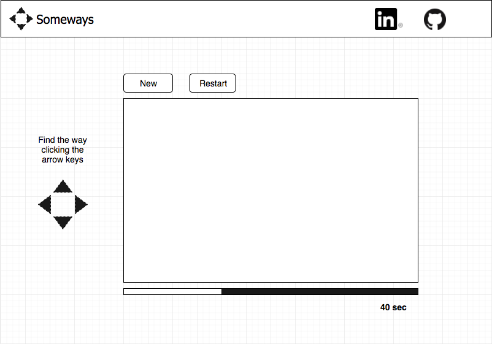

# Someways

## Background and Overview
Someways is a game where the user have to connect two objects, which are inside a labyrinth.

The labyrinth is created by an algorithm which generates a spanning tree of a two-dimensional rectangle grid. It means that only exist one way from the root in the bottom-left corner to every other cell in the maze.

By clicking the arrows, the user could move one of the 2 objects, the one that starts at the bottom-left corner, to find the other one that is near to the the opposite corner, diagonally. The user have to find the path within 1 minute.

## Functionality & MVP
In Someways, users will be able to:

- [ ] Generate a new maze.
- [ ] Visualize how the maze is generated.
- [ ] Restart the same maze.
- [ ] Watch the timer.

## Wireframes

Someways consists of a single screen with the maze canvas, 2 control buttons (Start and Restart), an area with instructions, and a timer. Also, nav links to the Github and LinkedIn.

## Architecture and Technologies
This project will be implemented with the following technologies:

Vanilla JavaScript for overall structure and game logic.
HTML5 Canvas for DOM manipulation and rendering.
Webpack to bundle and serve up the various scripts.
In addition to the webpack entry file, there will be four scripts involved in this project:

someways.js: this script will handle the logic for creating and updating the necessary DOM elements.

maze.js: this script will create the labyrinth.

clock.js: this script has the timer details.

path.js: this script will house the positions of the objects.

## Implementation Timeline
Over the weekend:
  Make a first version of canvas maze.

Day 1: Finish labyrinth logics and design.
       Make controls.

Day 2: Make and design clock bar.

Day 3: Place objects and movement logic for one of them.

Day 4: Navbar and design.

Bonus features

Add sounds (clock, win and lose)
